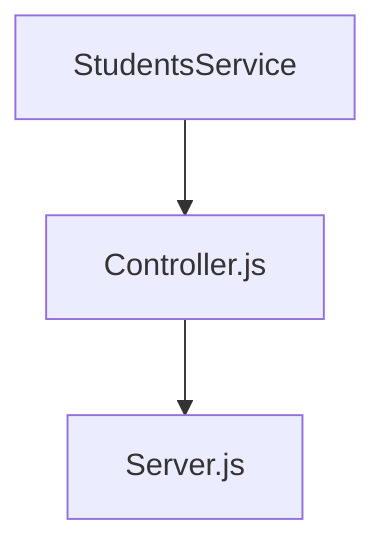

**API de Thinking API**

Hola que tal El dia hoy realizamos una api de la base Thinking API  esta echa en package.json

Los puntos claves para este proyecto son los siguientes.
<li> Habilitar un endpoint para consultar todos los estudiantes con todos sus campos.
<li> Habilitar un endpoint para consultar los emails de todos los estudiantes que tengan certificación
<li> Habilitar un endpoint para consultar todos los estudiantes que tengan credits mayor a 500

Nos basaremos en el siguiente diagrama

