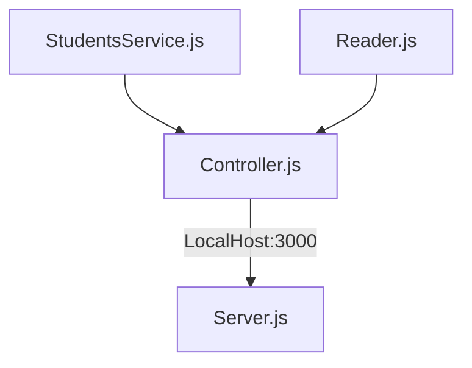

# API Thinking 🏫
## CodeChallenge Porject  LaunchX ## 
## Sobre el proyecto ##
<p>Hola que tal el dia hoy realizamos una api  con base a estudiantes como nombrela propuesta es  Thinking API  🏫

<p>Este proyecto esta echo con Express javaScript node js. 
<p>Adicionalmente se realizaron pruebas unitarias con Jest. 

### versions ###
- Node js version `16.14.0`
- jest version `26.0.0`
- Express `4.18.1`
- lint `8.14.0`

**Los puntos claves para este proyecto son los siguientes.**

<li> Habilitar un endpoint para consultar todos los estudiantes con todos sus campos.👨‍🎓
<li> Habilitar un endpoint para consultar los emails de todos los estudiantes que tengan certificación 🎓
<li> Habilitar un endpoint para consultar todos los estudiantes que tengan credits mayor a 500✔️

<br>

**Nos basaremos en el siguiente diagrama para realizar el proyecto**


| Enpoints          | Request     | Response | 
|------------------------------|---------------------------------|-------------------------------------|
| LocalHost:3000/v1/students/  | v1/LocalHost:3000/v1/students/  |Obtiene la lista de los estudiantes  | 
| LocalHost:3000/v1/students/haveCertification  | v1/LocalHost:3000/v1/students/haveCertification  |Obtiene la lista de los estudiantes que cuenten con certificación  | 
| LocalHost:3000/v1/students/credits  | v1/LocalHost:3000/v1/students/credits  |Obtiene la lista de los estudiantes que cuenten con calificacion mayor de 500 puntos  | 


**Pruebas en Github Actions**
<p> En el apartado de actions se pueden verificar las pruebas de unidad realizadas con exito.

## codigo ##
**StudentService.js**
<p> En este apartado se encuentra la logica
<li>StudentService  retorna la informacion  de la base de datos en .json   
<li>ValidationCertification se usa el metodo filter para retornar un nuevo array donde  si haveCertification es igual a true  lo retorne  
<li>GetCredits se usa el mismo metodo filter para crear un array nuevo  si  es mayor a 500 puntos 

```
class StudentsService{
    static Getstudents(Students){
        return Students
    }
    static ValidationCertification(Students){
        const validation= Students.filter((student)=>student.haveCertification==true);
        return  validation;
    }
    static GetCredits(Students){
        const Credits= Students.filter((student)=>student.credits >= 500);
        return  Credits;
    }
}

module.exports=StudentsService

```

**StudentService.js**
<p>Esta encargado a realizar las conexiones junto con Reader de la base de datos.

```
const  StudentsService =require("../services/StudentsService");
const   Reader = require("../utils/reader");

class Controller{
    static GetAllStudents(){
        const Students=Reader.readJsonFile("./visualpartners.json")
        return(StudentsService.Getstudents(Students))
    }

    static GetValidationCertification(){
        const Students=Reader.readJsonFile("./visualpartners.json")
        return(StudentsService.ValidationCertification(Students))
    }
    static Getbycredits(){
        const Students=Reader.readJsonFile("./visualpartners.json")
        return(StudentsService.GetCredits(Students))
    }

}

module.exports=Controllerconst  StudentsService =require("../services/StudentsService");
const   Reader = require("../utils/reader");

```

