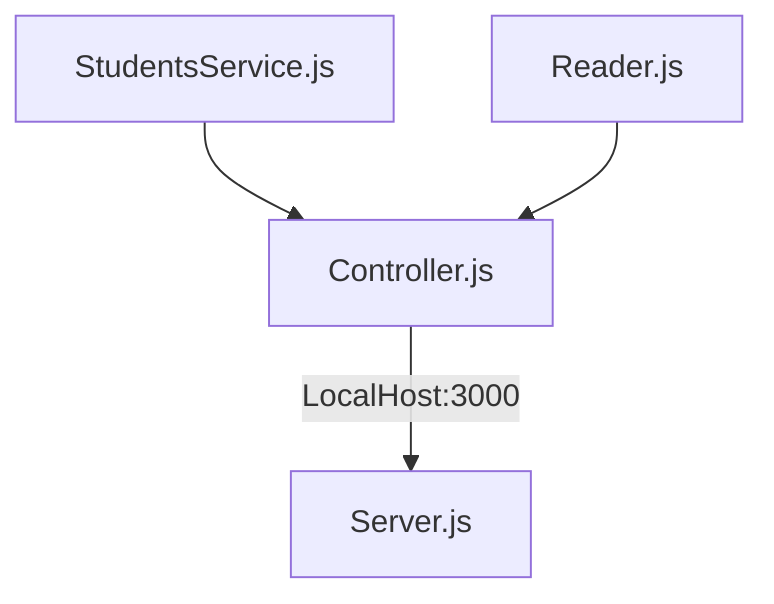

# API Thinking 🏫
## CodeChallenge Project LaunchX ## 
## Sobre el proyecto ##
<p>Hola que tal el dia hoy realizamos una api  con base a estudiantes como nombre Thinking API  🏫

<p>Este proyecto esta echo con Express javaScript node js. 
<p>Adicionalmente se realizaron pruebas unitarias con Jest. 

### versions ###
- npm version `8.3.1`
- Node js version `16.14.0`
- jest version `26.0.0`
- Express `4.18.1`
- eslint `8.14.0`

**Los puntos claves para este proyecto son los siguientes.**

<li> Habilitar un endpoint para consultar todos los estudiantes con todos sus campos.👨‍🎓
<li> Habilitar un endpoint para consultar los emails de todos los estudiantes que tengan certificación 🎓
<li> Habilitar un endpoint para consultar todos los estudiantes que tengan credits mayor a 500✔️

<br>

**Nos basaremos en el siguiente diagrama para realizar el proyecto**


| Enpoints          | Request     | Response | 
|------------------------------|---------------------------------|-------------------------------------|
| LocalHost:3000/v1/students/  | v1/LocalHost:3000/v1/students/  |Obtiene la lista de los estudiantes  | 
| LocalHost:3000/v1/students/haveCertification  | v1/LocalHost:3000/v1/students/haveCertification  |Obtiene la lista de los estudiantes que cuenten con certificación  | 
| LocalHost:3000/v1/students/credits  | v1/LocalHost:3000/v1/students/credits  |Obtiene la lista de los estudiantes que cuenten con calificacion mayor de 500 puntos  | 


## codigo ##
**StudentService.js**
<p> En este apartado se encuentra la logica
<li>StudentService  retorna la informacion  de la base de datos en .json   
<li>ValidationCertification se usa el metodo filter para retornar un nuevo array donde  si haveCertification es igual a true  lo retorne  
<li>GetCredits se usa el mismo metodo filter para crear un array nuevo  si  es mayor a 500 puntos 

```
class StudentsService{
    static Getstudents(Students){
        return Students
    }
    static ValidationCertification(Students){
        const validation= Students.filter((student)=>student.haveCertification==true);
        return  validation;
    }
    static GetCredits(Students){
        const Credits= Students.filter((student)=>student.credits >= 500);
        return  Credits;
    }
}

module.exports=StudentsService

```

**StudentService.js**
<p>Esta encargado a realizar las conexiones junto con Reader de la base de datos.

```
const  StudentsService =require("../services/StudentsService");
const   Reader = require("../utils/reader");

class Controller{
    static GetAllStudents(){
        const Students=Reader.readJsonFile("./visualpartners.json")
        return(StudentsService.Getstudents(Students))
    }

    static GetValidationCertification(){
        const Students=Reader.readJsonFile("./visualpartners.json")
        return(StudentsService.ValidationCertification(Students))
    }
    static Getbycredits(){
        const Students=Reader.readJsonFile("./visualpartners.json")
        return(StudentsService.GetCredits(Students))
    }

}

module.exports=Controllerconst  StudentsService =require("../services/StudentsService");
const   Reader = require("../utils/reader");

```

## Prueba este proyecto de manera local ##

## importante se requiere  tener previamente  instalado npm node js esta version de prueba esta echa para SO windows puede requeriri cambios en el acrichivo json.

 Puedes correr este proyecto de manera local con los siguientes pasos.  

- baja como zip o clonando este repo.
 

- instala Express `npm install express --save`
 

- Ahora corre el server con el siguiente comando `npm run server`
 


<p> verficando las pruebas con postaman

## probando end points

- all students 


- all students certifications true


- all students  more 500 pts


## pruebas de unidad ##

**Pruebas en Github Actions**
<p> En el apartado de actions se pueden verificar las pruebas de unidad realizadas con exito.

Devuelve todo lso students 
opte por comporar el primer student con su id para saber que esta devolviendo correctamente su valor
(Se pueden realizar pruebas con cada info del estudiante en caso de requerirlo) 
```
describe("Tests StudentsServices Reader", () => {
    test("Requerimiento devuelve los Students", () => {       
        const  GetallStudents= Students
        expect(GetallStudents[0].id).toBe("6264d5d89f1df827eb84bb23");
    });
});

```
Devuelve todos los studiantes con true

De igual forma se tomo el primer estudiante ya que este cuenta con true. 
```
describe("Test Validationcertification con true", () => {
    test("Devuelve a los Estudents con true", () => {       
        const Validationcertification = StudentsService.ValidationCertification(Students);
        expect(Validationcertification[0].haveCertification).toBe(true);
    });
});
```
Devuelve a los estudiantes que tengan  mas 500 opte por poner los primeros 2 estudiantes ya que cuenta con mas de 500 creditos. 
```
describe("Tests GetCredits mayor de 500", () => {
    test("Devulve a los que tienen mayor de 500", () => {       
        const Credits = StudentsService.GetCredits(Students);
        expect(Credits[0].credits).toBe(508);
        expect(Credits[1].credits).toBe(677);
    });
})
```


