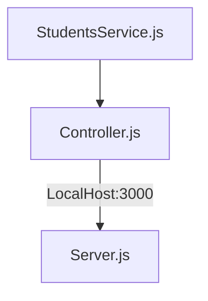

# API de Thinking API
**Sobre el proyecto**

Hola que tal el dia hoy realizamos una api de la base Thinking API 

Este proyecto esta echo con javaScript Express y con "nodejs en su version 16.14.0"

Adicionalmente se realizaron pruebas unitarias con Jest en su version 26. Se realizo con  esta version por la compatibilidad de automatizacion  en github. 

**Los puntos claves para este proyecto son los siguientes.**

<li> Habilitar un endpoint para consultar todos los estudiantes con todos sus campos.
<li> Habilitar un endpoint para consultar los emails de todos los estudiantes que tengan certificación
<li> Habilitar un endpoint para consultar todos los estudiantes que tengan credits mayor a 500

 

**Nos basaremos en el siguiente diagrama para realizar el proyecto**

| Enpoints          | Request     | Response | 
|------------------------------|---------------------------------|-------------------------------------|
| LocalHost:3000/v1/students/  | v1/LocalHost:3000/v1/students/  |Obtiene la lista de los estudiantes  | 
| LocalHost:3000/v1/students/haveCertification  | v1/LocalHost:3000/v1/students/haveCertification  |Obtiene la lista de los estudiantes que cuenten con certificación  | 
| LocalHost:3000/v1/students/credits  | v1/LocalHost:3000/v1/students/credits  |Obtiene la lista de los estudiantes que cuenten con calificacion mayor de 500 puntos  | 

**Codigo**

StudentsService

 `class StudentsService{
    static Getstudents(Students){
        return Students
    }
    static ValidationCertification(Students){
        const validation= Students.filter((student)=>student.haveCertification==true);
        return  validation;
    }
    static GetCredits(Students){
        const Credits= Students.filter((student)=>student.credits >= 500);
        return  Credits;
    }
}
module.exports=StudentsService`

Controller

`const  StudentsService =require("../services/StudentsService");
const   Reader = require("../utils/reader");

class Controller{
    static GetAllStudents(){
        const Students=Reader.readJsonFile("./visualpartners.json")
        return(StudentsService.Getstudents(Students))
    }

    static GetValidationCertification(){
        const Students=Reader.readJsonFile("./visualpartners.json")
        return(StudentsService.ValidationCertification(Students))
    }
    static Getbycredits(){
        const Students=Reader.readJsonFile("./visualpartners.json")
        return(StudentsService.GetCredits(Students))
    }

}

module.exports=Controller`
